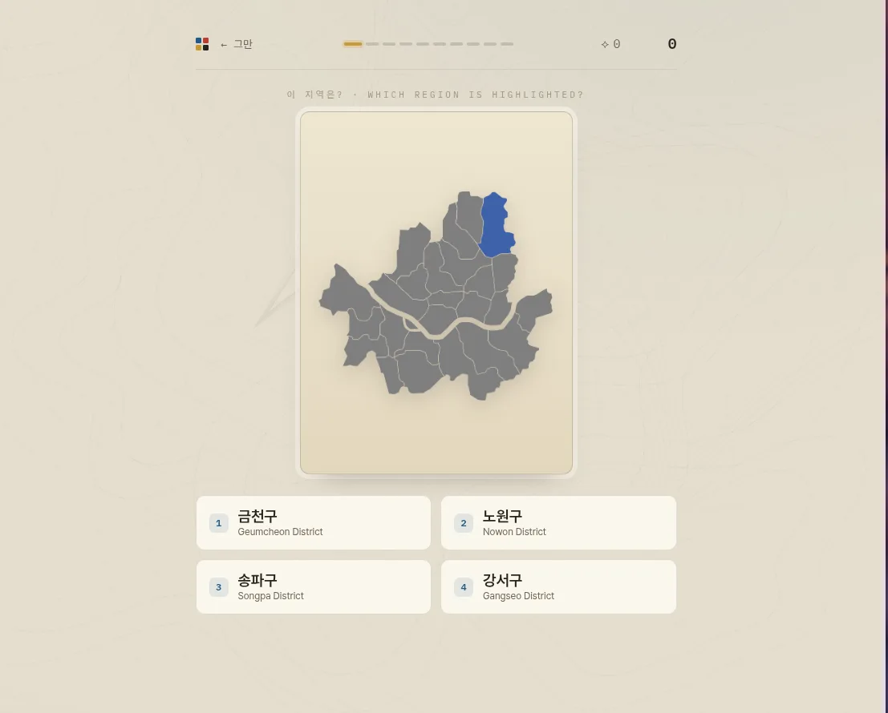
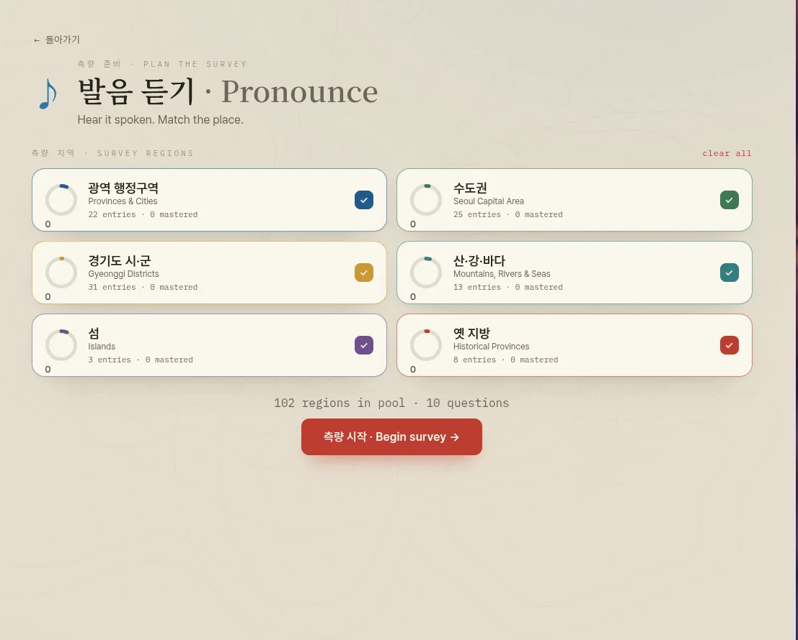

# 한반도를 측량하라 · Korea Field Survey

A browser game for learning South Korean geography.

Play it here: https://taylormichaelhall.com/korea-geo/

Practice provinces, cities, Seoul and Gyeonggi districts, islands, mountains, rivers, seas, Korean pronunciation, and hanja through short quiz modes. Progress is saved in your browser with `localStorage`; there is no account or backend.

| Locate | Plan a survey |
| :---: | :---: |
|  |  |

## Modes

* **Field Survey** — mixed practice with maps, pronunciation, hanja, and location questions
* **Locate** — identify the highlighted region on the map
* **Pronounce** — hear a Korean place name and choose the match
* **Hanja** — match Chinese characters to the Korean place name
* **Atlas** — browse all entries as a reference

Keyboard shortcuts:

* `1–4` to answer
* `Enter` or `Space` to continue

## Run locally

```
npm install
npm run dev      # http://localhost:5173
npm run build    # production build -> dist/
npm run preview  # preview production build
```

## Tech

Built with Vite, React, and TypeScript. The app is fully static and can be hosted anywhere.

Main project files:

* `src/data/geography.json` — geography entries
* `public/media/` — map and media assets
* `src/lib/quiz.ts` — question generation
* `src/lib/progress.ts` — progress, XP, and mastery tracking

## Sources and licensing

This is a free, non-commercial study project.

* Maps are from Wikimedia Commons.
* Facts are adapted from English Wikipedia.
* Place names and groupings are adapted from the Ultimate Korean Geography Anki deck.
* Pronunciation audio is generated with text-to-speech; no third-party pronunciation recordings are stored or served.

See the in-app Credits page for attribution and license details.
